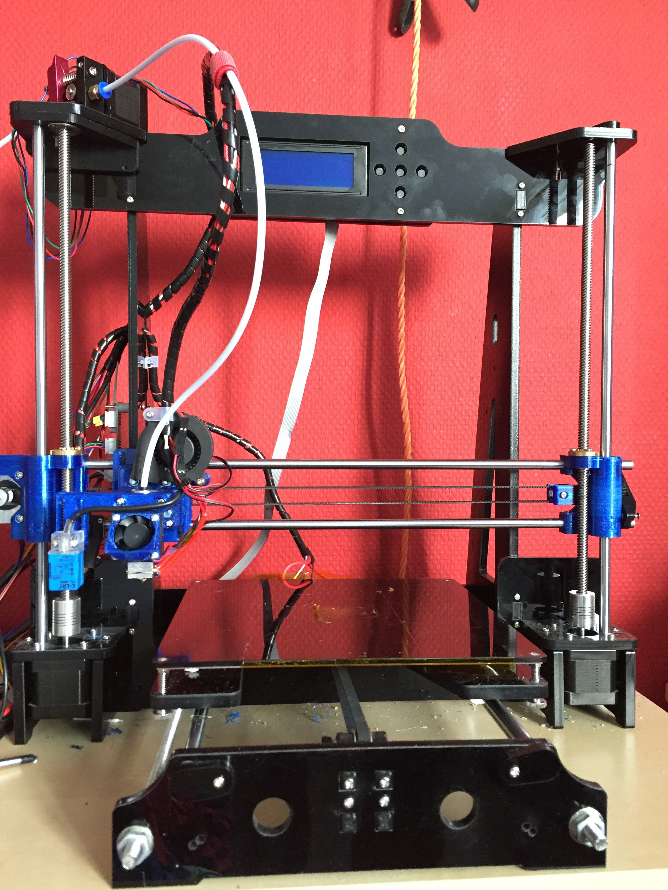
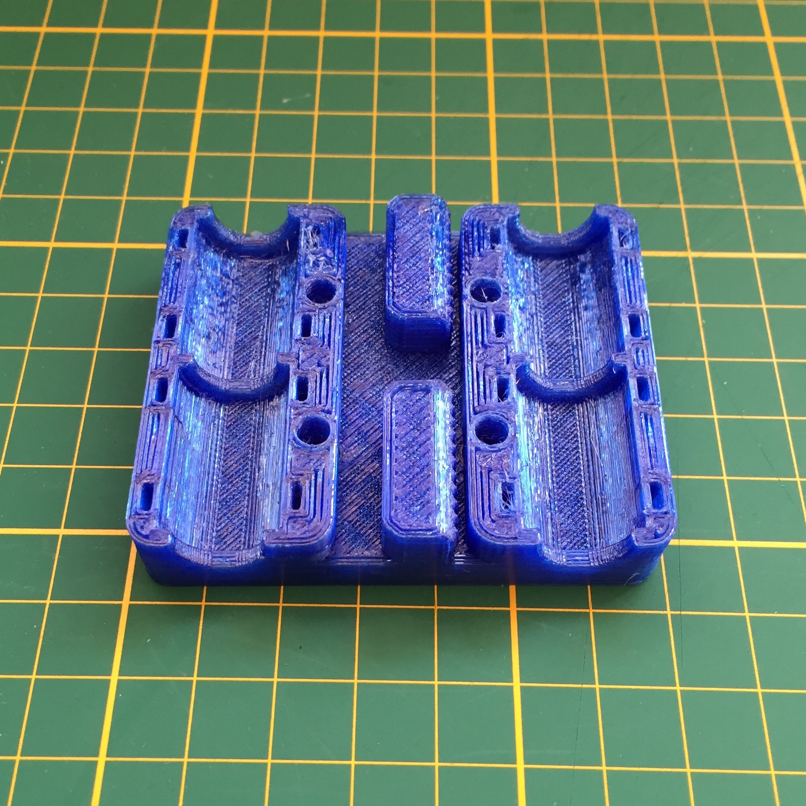

I just love 3D printing, I never thought that it would be so much fun, because we have a 3D printer at work but rarely use it, I never gave it too much attention.

Now that I have my own printer it feels like I can make all the silly things I wanted to try or fiddle with but never felt like it was worth spending too much money one to have made.

Also the fact that you can upgrade, repair, change fiddle and calibrate the device is very appealing to me

* TOC
{:toc}

## My Printer's specs

{: .project-image-medium}

|||
|------------------|--------------|
| **Brand**        | TronXY       |
| **Type**         | Prusa i3     |
| **Extruder**     | E3D V6 |
| **Heated bed**   | yes          |
| **Firmware**     | [Marlin](https://github.com/erikkallen/Marlin_tronxy)    |
| **HAL Sensor**   | PL-08N       |

## Firmware

[The firmware I use on this printer](3d_printer_firmware.html)

## Calibration

[My calibration steps](3d_printer_calibration.html)

## Filaments

##### [Real&reg;](http://real-filament.com) Filament [PET-G](http://real-filament.com/pages/product-details?id=2) Translucent blue

* Print on Kapton tape, with heated bed at **80 &deg;C**
* Extruder temp: **235 &deg;C**
* Speed: **60 mm/s&sup2;**

##### Manufacturer supplied PLA black

* Print on Kapton tape, with heated bed at **60 &deg;C**
* Extruder temp: **195 &deg;C**
* Speed: **60 mm/s&sup2;**

##### Manufacturer supplied ABS black

* Print on Kapton tape, with heated bed at **105 &deg;C**
* Extruder temp: **220 &deg;C**
* Speed: **60 mm/s&sup2;**

##### Purement antibacterial PLA white

* Haven't tried this yet will update as soon as I can
* Print on Kapton tape, with heated bed at **? &deg;C**
* Extruder temp: **? &deg;C**
* Speed: **? mm/s&sup2;**

## Upgrades

[The upgrades I have done to my printer](3d_printer_upgrades.html)

## Printed objects

Most of my designs can be found on [Thingyverse](http://www.thingiverse.com/erikkallen/designs)
I use Autodesk Fusion 360 for designing

#### Some printed objects:

[{: .project-image-medium}](http://www.thingiverse.com/thing:38277)
[{: .project-image-medium}](http://www.thingiverse.com/thing:1103976)
[{: .project-image-medium}](http://www.thingiverse.com/thing:119616)
{: .project-image-medium}

## Settings

### My Slic3r config


