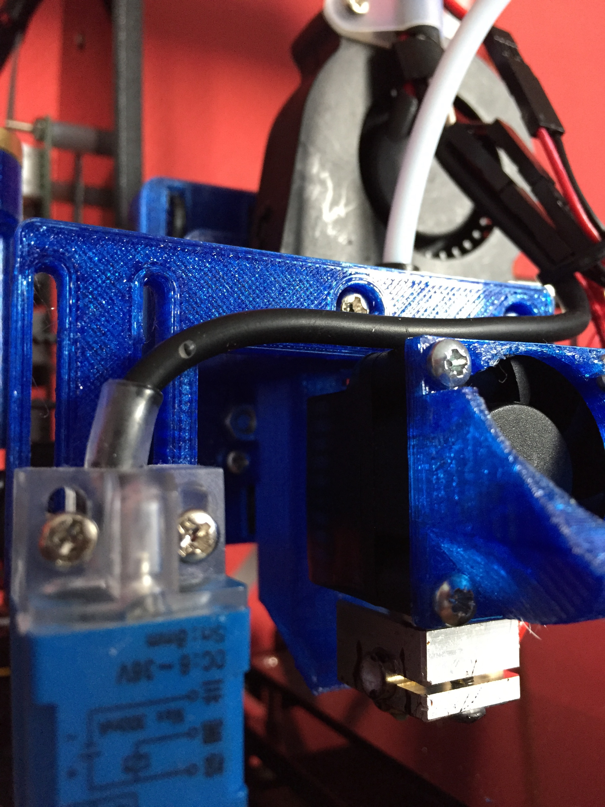
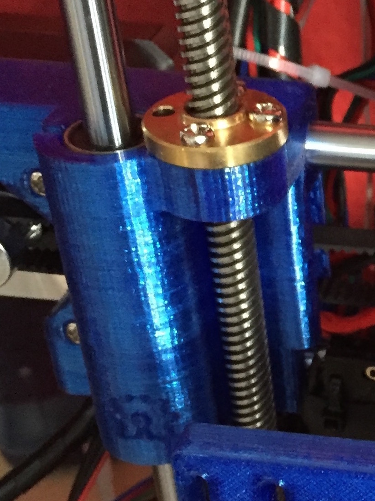
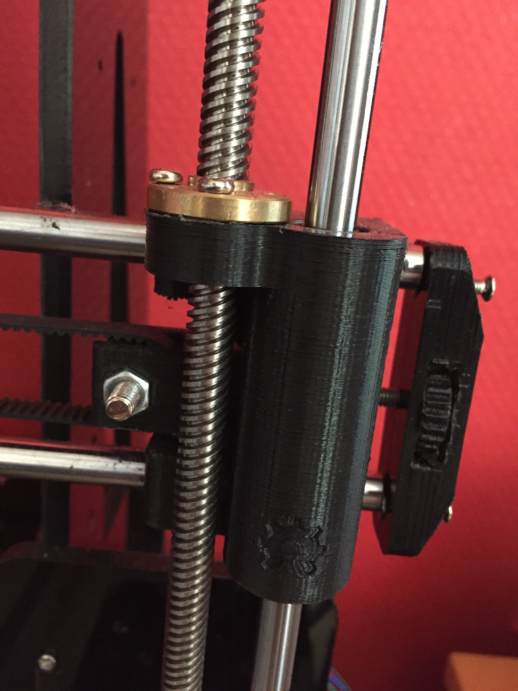
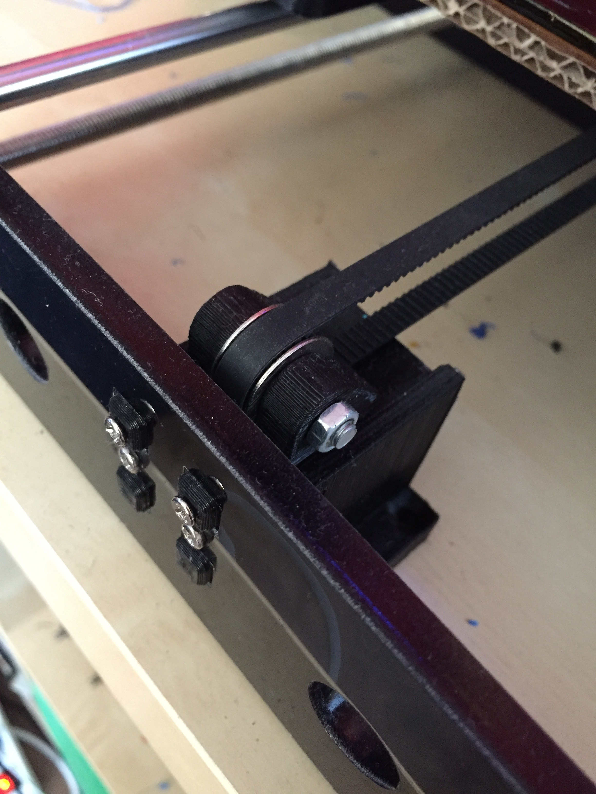

## [3D Printer](3d_printer.html) &raquo; upgrades

Here I have a list of all the upgrades I have done to my printer, where possible I will link to the files I used.

#### E3D v6 hotend!

I purchased an E3D v6 hotend with bowden coupler from [123-3D.nl](https://www.123-3d.nl/E3D-v6-hotend-complete-kit-1-75-mm-thermistor-bowden-uitbreiding-origineel-i1771-t378.html), and I must say I love the thing.
{: .project-image-medium}

BTW, If you are from the Netherlands, [123-3d.nl](https://123-3d.nl) is an awesome site to buy 3d printer stuff (order before 23:59 and next day delivery)

The parts I printed to mount the hotend are:

* [E3Dv6 Bowden X-carriage mount v2 for Prusa i3](http://www.thingiverse.com/thing:1632847) by Tech2C
* [Bowden extruder inductance sensor mount PL-08N](http://www.thingiverse.com/thing:1672521)
* [Prusa i3 Rework X-carriage with additional holes for Wade's extruder](http://www.thingiverse.com/thing:586636)

#### Heated bed

* I put a piece of cardboard under the heated bed which significantly improved the warmup time.

#### X Carriage

* I printed a replacement X-Idler with tensioning screw from MazaaFIN [X-Idler Thing](http://www.thingiverse.com/thing:1103976)
* Also replaced X-Idler and motor mount with Prusa rework version [Smooth X-axis for Prusa i3 with Leadscrews](http://www.thingiverse.com/thing:1103976)

{: .project-image-medium}
{: .project-image-medium}

#### Y Carriage

* I printed a replacement Y-Idler with tensioning screws from bunjatec [Y-Idler Thing](http://www.thingiverse.com/thing:1298757)

{: .project-image-medium}

#### MK8 Fan air redirect for PETG

* I made an Air redirector because the extruder fan was blowing air on my print and the PETG filament does not like that.

[Back](3d_printer.html)
