The story began when I stumbled upon a Youtube [video](https://www.youtube.com/watch?v=hHD10DjxM1g) from Grant Thompson (The King of Random) where he created his own backyard foundry.

I immediately got excited and started to look for an excuse to build one of my own.
Luckily this excuse was but a few clicks away for someone had built a lathe by simply casting aluminum parts. The magical name in all this is David Gingery who has published a book explaining how to make your very own metal working lathe.

So that takes care of the excuse to build the foundry so lets gets started.
Because all the required materials en units used are different from the materials used in the video (I live in the Netherlands)  I decided to post my recipe here for the lovely folks on the European side of the ocean.

##Building the backyard foundry (overview)

* TOC
{:toc}

### Materials used

As mentioned before the materials that I used are somewhat different from the ones used in the video

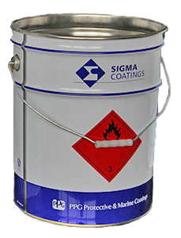{: .project-image-small}
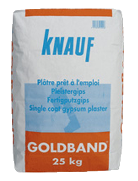{: .project-image-small}
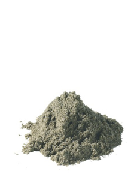{: .project-image-small}

#### Making the foundry

First of instead of using "Plaster of Paris" our local hardware store has something called "Goudband" or "Goldband" which should be similar if not the same.

It can be obtained at a Praxis, Formido, Gamma, Hornbach or Bauhaus for around &euro; 9,00

For the bucket I went to a local metal recycling company [Simmeren](http://www.simmeren.nl/) and got an old paint bucket 18.5L can and piece of stainless steel pipe for 1 Euro.
If there is no local recycling company a painting company or metal work shop might have something similar. Worst case you can go to the Xenos and buy a metal garbage bin, it should do the trick to but might be a bit more expensive.

#### Building steps

So lets get started:

* First I mixed the sand and goldband in equal parts filling the bucket to the second rim from the top.
* Then I pushed a bucket with some stirofoam cut in circles into the centre.
* Let it dry for about 36 hours.
* Now drill a hole into the foundry for the air pipe and your done.

#### Making the lid

As for the lid I tried to find a "bigmouth bucket" but could not, so instead I went to the Dutch version of the dollar store (Action) and got a bucket for doing the dishes. The price was around &euro; 1,30

For the brackets I used some threaded rod which I still had lying around, which I simply bent on the bench vice.

{: .project-image-small}
{: .project-image-small}
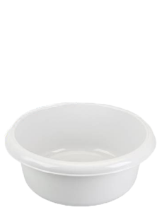{: .project-image-small}
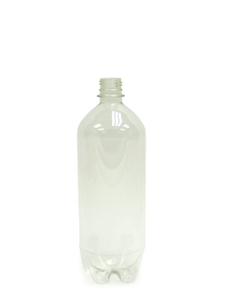{: .project-image-small}
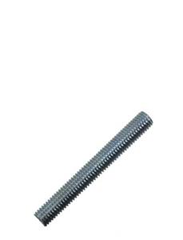{: .project-image-small}

#### Building steps

Now for making the lid:

* First cut the coda bottle under the label, and ductape the bottom closed again.
* Next I mixed the sand and goldband in equal parts filling the dishwash bucket half way.
* Cut the rods to about 30 cm and bend them into a D shape.
* Place the rods into the mix.
* Let it dry for about 36 hours.
* And you're done.

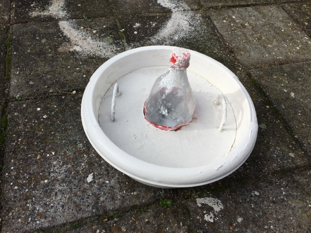{: .multiple-borders}

### Final result
And here she is: The completed foundry.

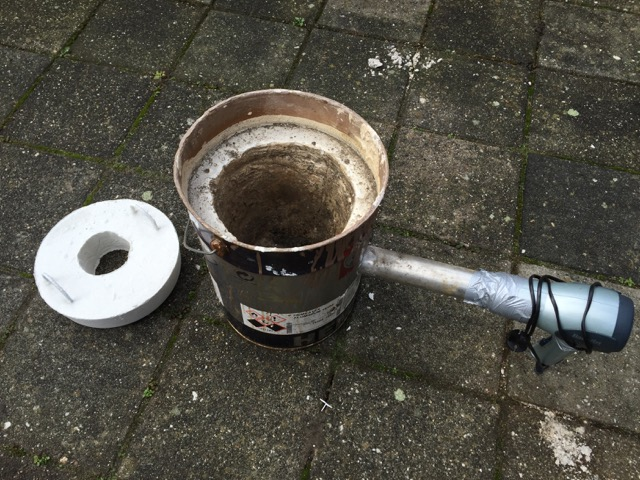{: .multiple-borders}
*Completed foundry*

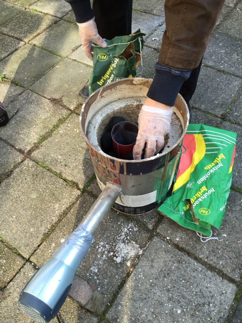{: .multiple-borders}
*Adding the coal brickets*

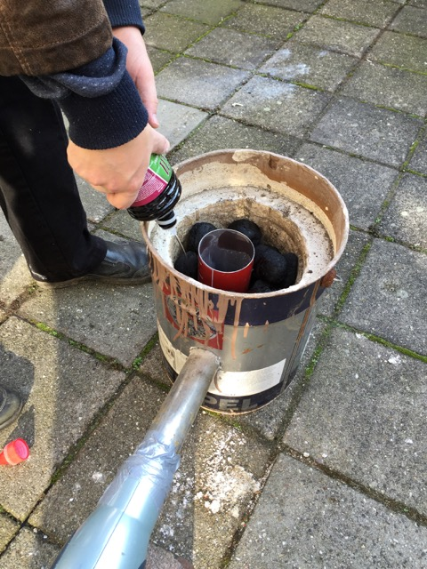{: .multiple-borders}
*Soaking the brickets with lighter fluid*

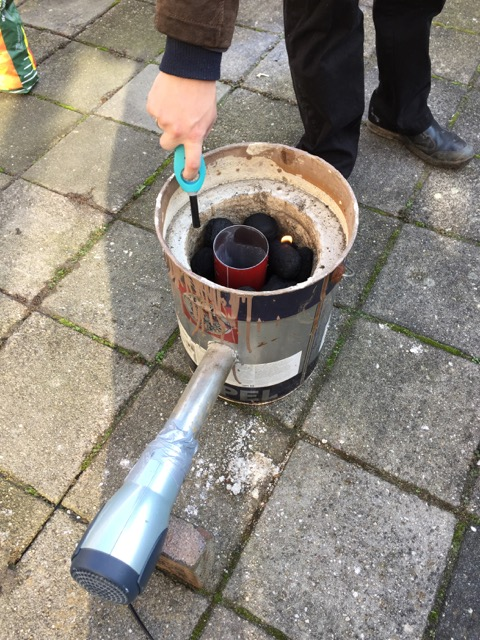{: .multiple-borders}
*Light the foundry*

### The first pour

So it was a sunny day in The Netherlands and I took advantage of it, by testing out my foundry.
I had quite some aluminum lying around which I figured I would turn it into ingot's for now.

I also tried to make some greensand, but unfortunately it failed, so I tried to cast something using lost foam method, which failed as well :(

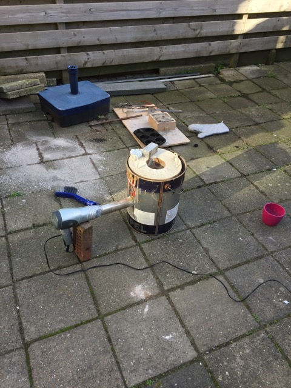{: .multiple-borders}
*Melting setup*

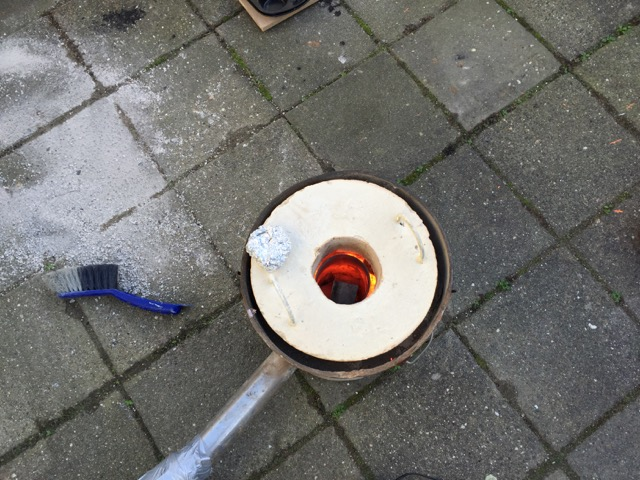{: .multiple-borders}
*All fired up*

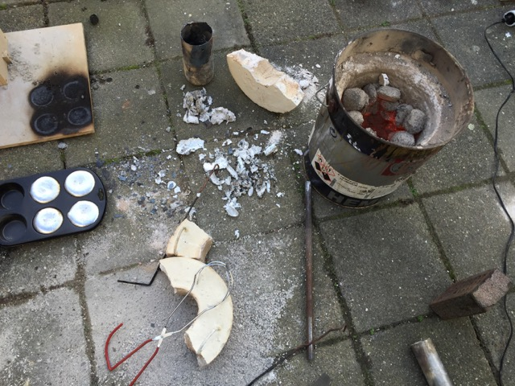{: .multiple-borders}
*Broken Lid*

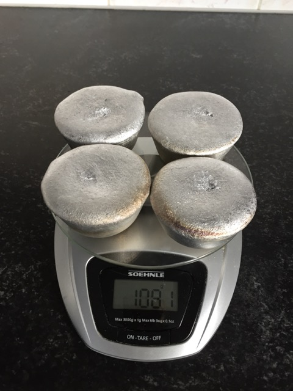{: .multiple-borders}
*Net result more than 1 kg!!*

### Conclusion

Making a foundry is a lot of fun, it takes a while to get everything together but it is definitely worth it. I will have to improve my foundry refractory mix to make a bette lid, the progress will be posted on the site. Well for now this is it.

*Last updated: {{page.updated}}*{: .page-updated}
